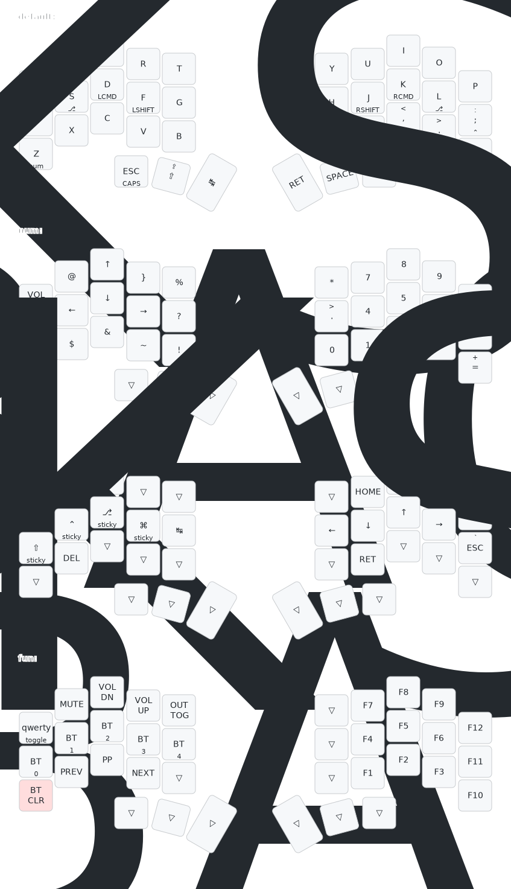

# Temper ZMK Config

This is a ZMK config for the [Bad Temper](https://github.com/essFitt/Bad-Temper). 

Some notes about this config:
- Four main layers (default, numbers/symbols, navigation, and function)
- Default layer is Colemak DHm, but there's also a QWERTY layer that can be toggled on
- Navigation layer has vim-like arrow keys

